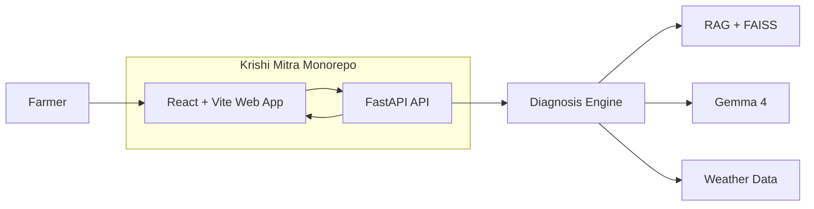

# Krishi Mitra

[](./LICENSE)
[](https://www.kaggle.com/)
[](https://react.dev/)
[](https://vitejs.dev/)
[](https://fastapi.tiangolo.com/)

Krishi Mitra is our project for **The Gemma 4 Good Hackathon**:

> Harness the power of Gemma 4 to drive positive change and global impact.

This repository contains a mobile-first React web app and a FastAPI backend workspace for an AI crop diagnosis product aimed at helping Indian farmers get practical, bilingual guidance in English and Telugu.

The backend uses the Gemini API with Gemma 4, which fits a CPU-only development laptop because the model is hosted rather than run locally.

## Architecture



### Frontend
- `apps/web`
- Mobile-first React UI
- Handles crop name, description, optional location, and image upload
- Sends multipart form data to the backend

### Backend
- `apps/api`
- FastAPI service
- Exposes `/health` and `/diagnose`
- Accepts form fields and image uploads
- Uses the Gemini API with Gemma 4 for hosted inference
- Falls back to a template response when the API key is missing or the model call fails

## What It Is

- `apps/web` - React + Vite frontend
- `apps/api` - FastAPI backend

## MVP Goal

Build a clean browser-based experience where a user can:

1. describe a crop problem
2. optionally upload a photo
3. optionally provide a location
4. receive a structured bilingual diagnosis and action plan

## Tech Stack

- React
- Vite
- FastAPI
- TypeScript
- Python
- google-genai

## Development

Install and run the workspace:

```bash
npm install
npm run dev:web
npm run dev:api
```

## Environment

Create a local environment file based on `.env.example`:

```bash
GOOGLE_API_KEY=your_google_ai_studio_api_key
GEMMA_MODEL=gemma-4-26b-a4b-it
NEXT_PUBLIC_API_BASE_URL=http://localhost:8000
```

`GOOGLE_API_KEY` is required for Gemini API access through Gemma 4.

## Notes

- The frontend sends multipart form data, including optional image uploads.
- The backend currently returns structured bilingual JSON and can be extended with RAG, weather tools, and stronger grounding later.
- The repo is intentionally kept source-only, without generated build artifacts or placeholder packages.

## License

MIT
