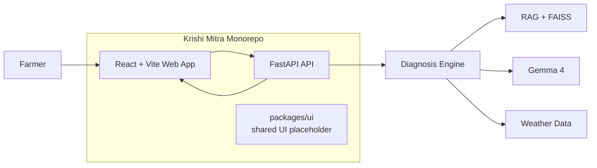

# Krishi Mitra

[](./LICENSE)
[](https://www.kaggle.com/)
[](https://react.dev/)
[](https://vitejs.dev/)
[](https://fastapi.tiangolo.com/)

Krishi Mitra is our project for **The Gemma 4 Good Hackathon**:

> Harness the power of Gemma 4 to drive positive change and global impact.

This repository contains a mobile-first React web app and a FastAPI backend workspace for an AI crop diagnosis product aimed at helping Indian farmers get practical, bilingual guidance in English and Telugu.

## Architecture



### Frontend
- `apps/web`
- Mobile-first React UI
- Handles crop name, description, optional location, and image upload
- Sends multipart form data to the backend

### Backend
- `apps/api`
- FastAPI service
- Exposes `/health` and `/diagnose`
- Accepts form fields and image uploads

### Shared Packages
- `packages/ui`
- Placeholder for reusable components and styles once the product grows

## What It Is

- `apps/web` - React + Vite frontend
- `apps/api` - FastAPI backend
- `packages/ui` - shared UI package placeholder

## MVP Goal

Build a clean browser-based experience where a user can:

1. describe a crop problem
2. optionally upload a photo
3. optionally provide a location
4. receive a structured bilingual diagnosis and action plan

## Tech Stack

- React
- Vite
- FastAPI
- TypeScript
- Python

## Development

Install and run the workspace:

```bash
npm install
npm run dev:web
npm run dev:api
```

## License

MIT
