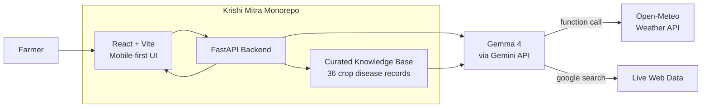

# Krishi Mitra

[](./LICENSE)
[](https://www.kaggle.com/)
[](https://react.dev/)
[](https://fastapi.tiangolo.com/)
[](https://ai.google.dev/gemma)

**Krishi Mitra** ("Farmer's Friend") is our submission for **The Gemma 4 Good Hackathon**.

> Harness the power of Gemma 4 to drive positive change and global impact.

It is a mobile-first crop diagnosis tool that gives Indian farmers a structured, bilingual (English + Telugu) diagnosis and action plan from a photo and a description of the problem — in seconds, at no cost.

---

## The Problem

Small and marginal farmers in India — who make up over 80% of the farming population — lose significant yield every season to diseases, pests, and nutrient deficiencies that go unidentified until it is too late. Access to an agronomist is limited to wealthier or well-connected farmers. For everyone else, advice comes from a dealer who may recommend products regardless of the actual diagnosis.

Krishi Mitra puts a knowledgeable, honest agronomist in every farmer's pocket.

---

## How It Works

A farmer describes their crop problem and optionally uploads a photo. The app detects their location automatically. The backend runs a three-layer grounding pipeline powered by Gemma 4:

```
Farmer input (crop + description + photo + location)
        │
        ▼
┌─────────────────────────────────┐
│  Layer 1: Curated Knowledge Base│  36 records across 10 major Indian crops
│  (keyword + symptom retrieval)  │  Cause, treatment, prevention, region
└────────────────┬────────────────┘
                 │ top-2 matched records injected into prompt
                 ▼
┌─────────────────────────────────┐
│  Layer 2: Gemma 4 (gemma-4-26b) │  Thinking enabled (high)
│  + Google Search grounding      │  Real-time disease data from the web
│  + Function calling for weather │  get_weather tool called when relevant
└────────────────┬────────────────┘
                 │ structured bilingual JSON
                 ▼
┌─────────────────────────────────┐
│  Layer 3: Live Weather          │  Open-Meteo API (free, no key required)
│  (called by Gemma as a tool)    │  Rain / wind advisory before spraying
└─────────────────────────────────┘
        │
        ▼
Bilingual diagnosis (English + Telugu)
Action steps · Weather advisory · Confidence score
```

---

## Gemma 4 Features Used

| Feature | How we use it |
|---|---|
| **Thinking (`thinking_level="high"`)** | Gemma reasons through symptom patterns before committing to a diagnosis, improving accuracy on ambiguous cases |
| **Image Understanding** | Farmers can upload a crop photo; Gemma analyses leaf texture, colour, and damage pattern alongside the text description |
| **Function Calling** | `get_weather` is declared as a tool; Gemma calls it autonomously when the farmer's location is known and weather affects treatment decisions (spraying in rain, wind drift) |
| **Google Search Grounding** | Gemma searches for current crop disease outbreaks, regional pest alerts, and approved pesticide guidance to supplement the curated knowledge base |
| **System Instructions** | Strict instruction to return only valid JSON with a fixed schema ensures reliable parsing across all responses |

---

## Architecture



### Frontend - `apps/web`
- React 19 + Vite + TypeScript
- Mobile-first layout with responsive breakpoints at 900px
- GPS location detection with BigDataCloud IP fallback
- Image upload with Canvas-based compression (max 1024px, JPEG 82%) before upload
- Loading skeleton that mirrors the result panel structure
- Bilingual result display with confidence score and weather advisory

### Backend - `apps/api`
- FastAPI with slowapi rate limiting (10 req/min per IP)
- CORS origins driven by `ALLOWED_ORIGINS` environment variable
- Structured request and response logging
- Three-layer grounding: curated KB → Gemma 4 + Google Search → weather function calling
- Graceful fallback response when `GOOGLE_API_KEY` is missing

---

## Setup

### 1. Get an API key

Go to [Google AI Studio](https://aistudio.google.com/apikey) and create a free API key. No billing required for Gemma 4 access.

### 2. Configure environment

```bash
cp .env.example .env
# Edit .env and set GOOGLE_API_KEY=your_key_here
```

### 3. Run the backend

```bash
cd apps/api
pip install -r requirements.txt
uvicorn app.main:app --reload
# API is now running at http://localhost:8000
```

### 4. Run the frontend

```bash
npm install
npm run dev:web
# Web app is now running at http://localhost:5173
```

---

## Environment Variables

| Variable | Required | Default | Description |
|---|---|---|---|
| `GOOGLE_API_KEY` | Yes | — | Google AI Studio key for Gemma 4 access |
| `GEMMA_MODEL` | No | `gemma-4-26b-a4b-it` | Gemma model ID |
| `VITE_API_BASE_URL` | No | `http://localhost:8000` | Backend URL used by the frontend |
| `ALLOWED_ORIGINS` | No | `http://localhost:5173,http://localhost:3000` | Comma-separated CORS origins |

---

## Deployment

### API (Docker)

```bash
# Build and run the API container
docker compose up --build

# Or build the image directly
docker build -t krishi-mitra-api ./apps/api
docker run -e GOOGLE_API_KEY=your_key -p 8000:8000 krishi-mitra-api
```

### Frontend (Static)

```bash
npm run build:web
# Output is in apps/web/dist — deploy to Vercel, Netlify, or any static host
```

For Vercel, set `VITE_API_BASE_URL` to your deployed API URL in the project environment settings.

---

## Knowledge Base

`apps/api/data/crop_diseases.json` contains 36 hand-curated records across 10 major Indian crops:

| Crop | Diseases / Pests |
|---|---|
| Tomato | Late Blight, Early Blight, Leaf Curl Virus, Fusarium Wilt, Bacterial Canker, Fruit Borer |
| Cotton | Bollworm, Whitefly + CLCV, Aphids, Mealybug |
| Rice / Paddy | Blast, Bacterial Leaf Blight, Brown Spot, Sheath Blight, Stem Borer |
| Wheat | Yellow Rust, Powdery Mildew, Loose Smut |
| Chilli | Anthracnose, Leaf Curl (Thrips), Powdery Mildew |
| Groundnut | Tikka (Leaf Spot), Collar Rot, Stem Rot |
| Maize | Fall Armyworm, Downy Mildew, Northern Blight |
| Onion | Purple Blotch, Thrips |
| Sugarcane | Red Rot, Smut, Pyrilla |
| Soybean | Yellow Mosaic Virus, Rust |

Each record includes cause, symptoms, treatment steps (English), prevention, season, and common Indian regions. The retrieval is keyword and symptom based — no embeddings, no GPU required.

---

## Tech Stack

| Layer | Technology |
|---|---|
| Frontend | React 19, Vite, TypeScript |
| Backend | Python 3.12, FastAPI, slowapi |
| AI | Gemma 4 (`gemma-4-26b-a4b-it`) via Gemini API |
| Weather | Open-Meteo (geocoding + forecast, free, no key) |
| Location | BigDataCloud reverse geocode (GPS + IP fallback) |

---

## License

MIT
